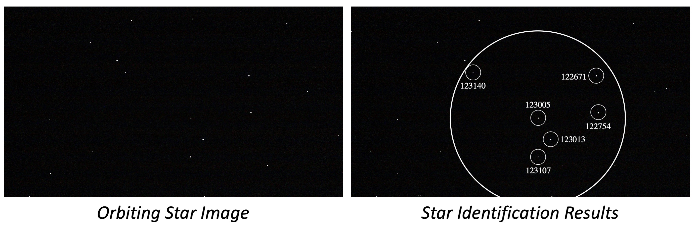

# star-ID-graph-match
Source Code of "An Accurate Star Identification Approach Based on Spectral Graph Matching for Attitude Measurement of Spacecraft"

```
@article{you2022accurate,
  title={An accurate star identification approach based on spectral graph matching for attitude measurement of spacecraft},
  author={You, Zhiyuan and Li, Junzheng and Zhang, Hongcheng and Yang, Bo and Le, Xinyi},
  journal={Complex & Intelligent Systems},
  volume={8},
  number={2},
  pages={1639--1652},
  year={2022}
}
```



## Qucik Start

1. ***Convert*** SAO star catalog to txt format 

    `sh scripts/convert.sh`

2. ***Simulate*** to generate star images

    `sh scripts/simulate.sh`

3. ***Generate*** database

    `sh scripts/gen_database.sh`

4. ***Search*** for star identification with noise

    `sh scripts/search.sh #STD_POSITION_NOISE #NUM_LOST_STAR #NUM_FALSE_STAR`

    For example, `sh scripts/search.sh 3.0 1 0` means *the std of positon noise* is 3.0 pixel, *the number of lost star* is 1, and *the number of false star* is 0.

## Parameter Selection

- ***Select*** the best radius of the neighbor circle, *i.e.*, $r$ in the paper

  `sh scripts/para_select/select_best_R_AD.sh`

- ***Select*** the uncertainty of the MST sum, *i.e.*, $\Delta w$ & $\Delta w^{max}$ in the paper

  `sh scripts/para_select/select_best_eps_mst.sh`

## Explanation

- The directories `utils/database` & `utils/search` share some similar scripts, including
  
  - *select_R_AD_helper.py, graph_helper.py*
  
    **Difference**. The scripts under `utils/database` use *Right Ascension* & *Declination* to select the neighbor stars and generate graph, while the scripts under `utils/search` use *Pixel Coordinates*. 

  - *k_vector_helper.py*
  
    **Difference**. The script under `utils/database` constructs *K-Vector Range Search Model*, while the script under `utils/search` searches using the constructed *Search Model*. 
